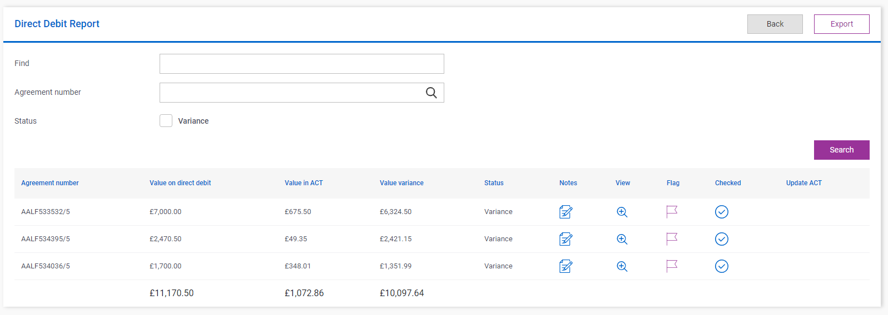

# Footer row

## Problem

Sometimes in your application when creating a list, you will want to have the final row show a calculation of each column at the bottom of the list.

## Implementation

We can use the `ShowFooterRow()` method and set this value to true to allow usage of this feature.

For each column value we then need to state what formula we are using to create the footer 'total' using the `FooterFormula()` method.  In here you can decide what total you wish to get.  Some useful options are `Sum`, `Average` and `Count`

```csharp
Column(x => x.Total)
.FooterFormula(AggregateFormula.Sum);
```

### Example

Below we have 3 columns of a list that use the `FooterFormula()` method.

```csharp
Column(x => x.ValueOnDirectDebit).FooterFormula(AggregateFormula.Sum);

Column(x => x.ValueInACT).FooterFormula(AggregateFormula.Sum);

Column(x => x.ValueVariance).FooterFormula(AggregateFormula.Sum);
```

And here we have the list UI implementing these footer formulas.


