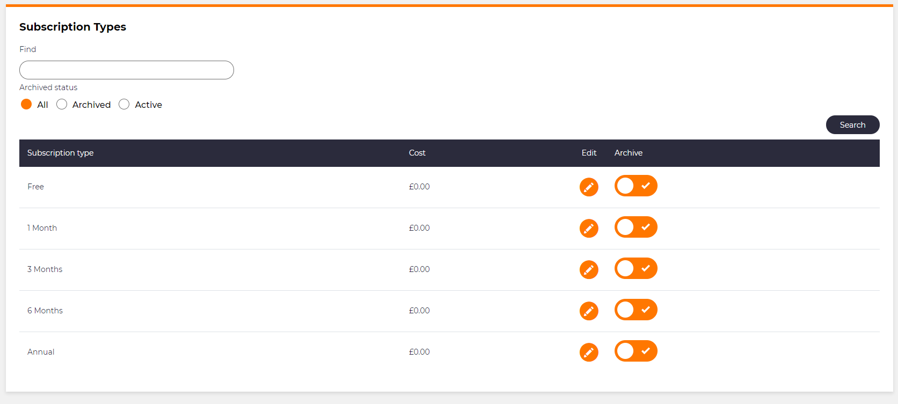
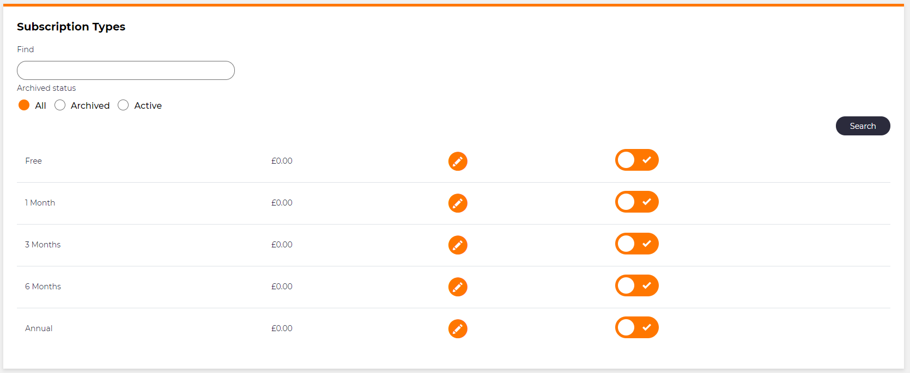

# Hiding header row

## Problem

There will be times in an application that you want to have a list module that does not show the header row of the list.  This can either be for design reasons or that the list columns are explicit in what they are showing.

## Implementation

In order to achieve this, we can use the `ShowHeaderRow()` method.  When we set the value to `false` and the header row will not show.

### Example

For and example we have the following list.



we can apply the following code to this list module.

```csharp
ShowHeaderRow(value: false);
```

The list will then show as below.


