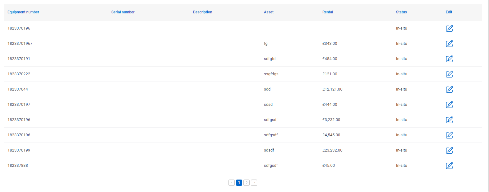

# Paging

## Problem

Sometimes you may be showing data in a list with many data entries.  These lists are quite cumbersome to navigate if you have to scroll down the entire screen to view them.  To solve this, we use pagination so that you can click through 'pages' of the list using a numbered index typically below the list.

## Implementation

In M# we have the `PageSize()` method where we can set how many rows we want to show on the page at any one time by passing an `int`.  The default page size row total is 10.

## Example

This can be added inline onto some other methods like `HeaderText()` or `DataSource()`.

```csharp
 HeaderText("Equipment list")
                .PageSize(10);
```

Or just called on its own

```csharp
HeaderText();
PageSize(10);
```

Either creates the same code in the controller.

Below is an example of the UI that is created.


