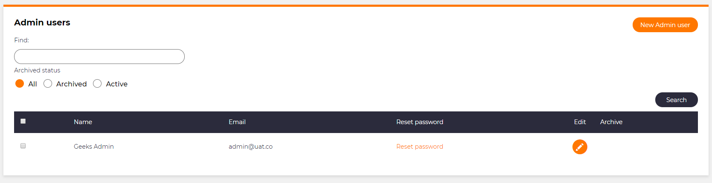

# Select checkbox column

## Problem

There will be times in your application when you will want to be able to select individual rows within a list.  This can be helpful when wanting to choose items in a list to export or to mark list items as completed.

## Implementation

In M#, there is the `SelectCheckbox()` method that adds a column to your list that allows the user to create a checkbox column so that each row can be selected using the checkbox.

Pass `true` and your list will have a checkbox on the left hand side.

### Example

Here we have a simple list module for admin users.

```csharp
using MSharp;

namespace Modules
{
    public class AdminUsersList : BaseListModule<Domain.AdminUser>
    {
        public AdminUsersList() : base()
        {
            SelectCheckbox(true);
            HeaderText("Admin users");
            ///================ Search: ================
            Search(GeneralSearch.AllFields).Label("Find:");

            Search(x => x.IsArchived).Label("Archived status")
              .Control(ControlType.HorizontalRadioButtons);

            SearchButton("Search")
                .OnClick(x => x.ReturnView());

            ///================ Columns: ================
            Column(x => x.Name);
            Column(x => x.Email);

            LinkColumn("Reset password").HeaderText("Reset password")
                .OnClick(x => x.CSharp("await PasswordResetService.RequestTicket(item);"))
                .ConfirmQuestion("Are you sure you want to reset password for this user?");

            ButtonColumn("Edit").HeaderText("Edit").GridColumnCssClass("actions")
                .Icon("mz mz-edit").NoText()
               .OnClick(x => x.Go<Admin.Settings.AdminUsers.EnterPage>().Send("item", "item.ID"));

            this.ArchiveButtonColumn("Admin user").CellVisibleIf("item != CurrentAdminUser");

            ///================ Buttons: ================
            Button("New Admin user").IsDefault()
                .OnClick(x => x.Go<Admin.Settings.AdminUsers.EnterPage>());
        }
    }
}
```

And this is what is seen in the UI.



In the controller we have the following list and task created

```csharp
public List<Guid> SelectedIds { get; set; } = new List<Guid>();

public Task<IEnumerable<AdminUser>> SelectedItems
=> SelectedIds.SelectAsync(x => Context.Current.Database().Get<AdminUser>(x));
```

We can use these to reference the selected items in our code so that we can perform tasks based on wether an item is selected or not.
