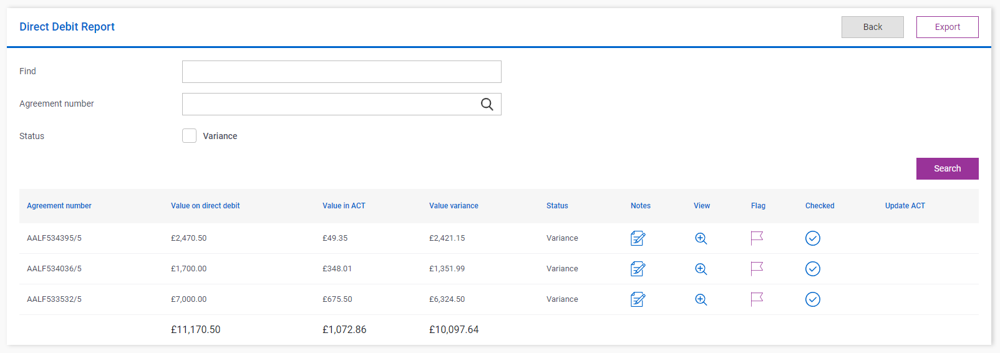

# Sorting

## Problem

There will be times when you want to sort your list module items by certain parameters (ie. by alphabetical order of an item's name or numerical order of an item's cost).

## Implementation

We can use the `SortingStatement()` method to define how we wish our list to be sorted.  With this method we can sort by the properties of each item and even pass other methods as a string through this method.

### Example

Below we have a list of direct debit reports that has had no sorting applied to it.


We can apply this code to the list module.

```csharp
SortingStatement("item.ValueInACT");
```

We are now sorting this list based on the `ValueInACT` property.  This creates the list structure below.



To reverse the order we can amend the sorting statement.

```csharp
SortingStatement("item.ValueInACT DESC");
```

Which would show in the UI as such.


