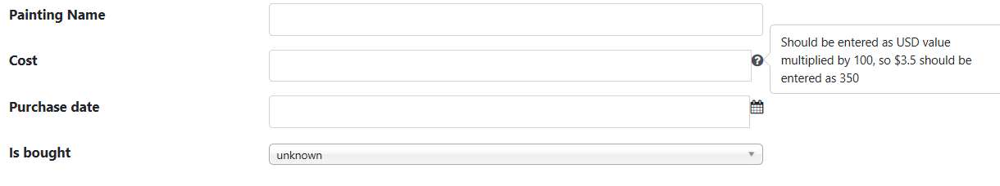

# Note, Documentation, User Help

## Problem

One of the needs of every software project is documentation and help in different levels and naturally an M# based project is not different in this matter.
We need to have different types of documentation and user help in different levels for different purposes which we'll talk about them here.

Some of the entities which we define are used by code so the developer using them should know how to use the entity and needs documentation.
We usually use XML documentation for this purpase and document our classes so the IDE will show the relevant docs when the class is being used.

Sometimes we want to show some help to the user when entering or modifying an entity of a type because the title on its own might not be enough to describe what we want.
Usually a question mark or a tooltip beside the field is used to describe its purpose in detail and we should be able to add such help to our forms as well.

Also you might want notes in the entity definition itself and not in the XML documentation or end-user forms.
These notes will help future developers of the entity definition itself including yourself to understand what is the context and role of a property inside the entity.
These notes should not have any effect on the generated code but should be there in the entity definition because they are useful there.

M# has features to support all of the above use-cases.

## Implementation

- To add XML documentation to the generated class, you use the `Documentation()` method on the property.
- to add a question mark (?) with additional description to the end user forms, use the `HelpText()` method on the property.
- To add some notes to the entity definition itself without any side-effects on the generated code, use the `Notes()` method on the property.

### Example

We have a `Painting` entity from our previous examples.

Now we want to add some documentation and user help for it.

It had a cost property and a isBought property indicating the cost of the painting when bought and isBought was a nullable bool (i.e. `bool?`) indicating if the painting is bought or not.

We add some notes and docs like this.

```csharp
using MSharp;

namespace Model
{
    public class Painting : EntityType
    {
        public Painting()
        {
            String("Painting Name").Mandatory();
            Int("Cost").CSharpTypeName("long")
                .Notes("We put this as long to test M# features, don't follow it as good design")
                .HelpText("Should be entered as USD value multiplied by 100, so $3.5 should be entered as 3500")
                .Documentation("The amount of money paid as usd value * 100 to buy this, not applicable for non-bought paintings");

            Date("Purchase date");
            Bool("Is bought").TrueText("bought").FalseText("donated").NullText("unknown")
                .Documentation("null means we are not sure if this has been bought or not or N/A")
                .Notes("Consider if we should use enum or not");
        }
    }
}
```

As you can see, We clarify in notes, what an entity developer should know which will be only available in the entity file in `#Model` project.
The `Documentation()` will be available in the generated C# as XML documentation which can be exported for tools like documentation generators (there is a checkbox for it in visual studio's project build settings) in the `Domain` project and is visible in the IDE.
The `HelpText()` one is visible in the UI like this



#### Generated Code

```csharp
public partial class Painting : GuidEntity
{
        /// <summary>
        /// Gets or sets the value of Cost on this Painting instance.<para/>
        /// The amount of money paid as usd value * 100 to buy this, not applicable for non-bought paintings<para/>
        /// </summary>
        public long? Cost { get; set; }

        /// <summary>
        /// Gets or sets a value indicating whether this Painting instance Is bought.<para/>
        /// null means we are not sure if this has been bought or not or N/A<para/>
        /// </summary>
        public bool? IsBought { get; set; }

        /// <summary>Gets or sets the value of PaintingName on this Painting instance.</summary>
        [System.ComponentModel.DisplayName("Painting Name")]
        public string PaintingName { get; set; }
        ...
}
```

As you can see our documentation for the `Cost` property is here in the generated code as a separate paragraph.
None of the notes appear here and the help text is not here in the code too.
