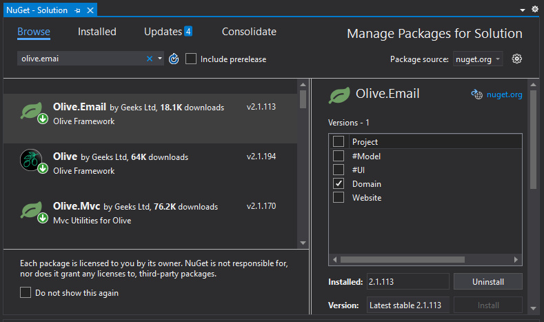

# Sending Email Notifications

## Problem

The Client wants a confirmation email to be sent when users complete a booking

## Implementation

There are a number of steps to allow your application to send emails, however once you have achieved this, adding new emails is simple.

1) Install Olive.Email on the Domain Project
2)	Add SMTP Configuration
3)	Enable Background Tasks
4)	Add AddEmail() Service to Startup
5)	Add an Automated Task to Project
6)	Add Entity, EmailMessage
7)	Add Entity, EmailTemplate
8)	Create Email Templates
9)	Add Logic to Create the Email
10)	Trigger This Logic From the UI.

Steps 1-7 only need to be completed for the first email.

### 1) Install Olive.Email on the Domain Project

This can be done using NuGet Package Manager



### 2) Add SMTP Configuration

In Website > appsettings.json add a section for Email

```javascript
"Email": {
    "From": {
      "Name": "My Company",
      "Address": "noreply@mycompany.com"
    },
    "Permitted": {
      "Domains": "uat.co",
      "Addresses": "an.email.address@geeks.ltd.uk"
    },
    "ReplyTo": {
      "Name": "My Company",
      "Address": "support@mycompany.com"
    },
    "EnableSsl": "true",
    "SmtpPort": "587",
    "SmtpHost": "smtp.yourhost.com",
    "Username": "theAccountThatSendsIt@emailProvider.com",
    "Password": "theP@sswordForThatAccount",
    "MaxRetries": "4"
}
```

Of Note:
 - Permitted – You can control who can receive emails from this application - Especially important during testing, to make sure you don’t accidentally send emails out to all the client’s users
 - SmtpHost, Username, Password – These are specific to the email account that physically sends the emails, it will not work without them. Eventually this should be set up with a Client email account but for testing you could use a test Gmail account you have access to. In this case use `"SmtpHost": "smtp.gmail.com"`.
 - If using a Gmail account ensure that you have enabled Less Secure App Access, this can be found in the Account Settings under Security.


### 3) Enable Background Tasks

While in appsettings.json ensure that Automated.Tasks are set to "Enabled": true. This is often turned off during testing and once you have checked emails are sending correctly you can set it back to false.

### 4) Add AddEmail() Service to Startup.

In Website > app_Start > Startup.cs you will need to add the AddEmail() service to ConfigureServices().

```csharp
    public override void ConfigureServices(IServiceCollection services)
    {
        base.ConfigureServices(services);

        services.AddDataAccess(x => x.SqlServer());
        services.AddDatabaseLogger();
        services.AddScheduledTasks();
        services.AddEmail();
        if (Environment.IsDevelopment())
            services.AddDevCommands(x => x.AddTempDatabase<SqlServerManager, ReferenceData>());
    }
```

This extension implements IEmailOutbox and handles the sending of emails saved in the database. You will need to use the Olive.Email library.

### 5)	Add an Automated Task to Project

In #Model > Project.cs you will need to add a new automated task. This Task will check for emails in the database every minute and send any due to be sent.

```csharp
    AutoTask("Send emails").Every(1, TimeUnit.Minute)
        .Run(@"var outbox = Context.Current.GetService<Olive.Email.IEmailOutbox>();
            await outbox.SendAll();");
```

On building, this code is injected into the TaskManager found in app_Start.

Your application is now capable of sending emails, you just need to make them.   

### 6) Add Entity, EmailMessage

Add a new Entity, EmailMessage to the Model. This EmailMessage will implement IEmailMessage and will therefore require the following properties:

```csharp
    public EmailMessage()
    {
        SoftDelete()
            .Implements("Olive.Email.IEmailMessage");

        BigString("Body").Lines(5).Mandatory();
        String("From address");
        String("From name");
        String("Reply to address");
        String("Reply to name");
        String("Subject");
        String("To");
        BigString("Attachments");
        String("Bcc").Max(2000);
        String("Cc").Max(2000);
        String("V calendar view");
        Int("Retries").Mandatory();
        DateTime("Sendable date").Default("c#:LocalTime.Now").Mandatory();
        Bool("Html").Mandatory();
        }
```

### 7) Add Entity, EmailTemplate

Add a new Entity, EmailTemplate to the Model. This EmailTemplate will implement IEmailTemplate.

```csharp
    public EmailTemplate()
    {
        InstanceAccessors("BookingConfirmationEmail");
        Implements("Olive.Email.IEmailTemplate");

        BigString("Body", 10);
        DefaultToString = String("Key");
        String("Mandatory placeholders");
        String("Subject");
    }
```

You will need an InstanceAccessor for every email template that you create.

### 8) Create Email Templates

Email templates are used to design your different emails. A Booking Confirmation email will have a different template to a New User Registration email.

This is done in the same way you would initialise an Enum type. 

If you have not already added an Instance Accessor for this template, go back to Email Template in the Model and add one.

In Domain > [DEV-SCRIPTS] > ReferenceData.cs create a new async task that will create all the email templates that you require.

```csharp
    async Task CreateEmailTemplates()
    {
        await Create(new EmailTemplate
        {
            Key = nameof(EmailTemplate.BookingConfirmationEmail),
            Subject = "Your Booking has been confirmed",
            Body = "Dear [#NAME#], <br/> Your booking for [#DATE#] has been accepted.",
            MandatoryPlaceholders = "NAME, DATE"
        });
    }
```

This method has to be added to those called from Create().

```csharp
    public async Task Create()
    {
        await Create(new Settings { Name = "Current", PasswordResetTicketExpiryMinutes = 2 });

        await CreateContentBlocks();
        await CreateAdmin();
        await CreateEmailTemplates();
    }
```

For an added challenge, why not make a CRUD allowing Users to create their own email templates.

### 9)	Add logic to create Email from EmailMessage and EmailTemplate

It is advisable to put all the methods for the creation of emails into their own service class, which should be created in Domain.

```csharp
using Olive;
using Olive.Entities;
using System.Threading.Tasks;
using Olive.Email;

namespace Domain
{
    public class EmailService
    {
        static IDatabase Database => Context.Current.Database();

        public static async Task SendBookingConfirmationEmail(Booking booking)
        {
            var template = EmailTemplate.BookingConfirmationEmail;

            var placeHolderValues = new
            {
                Name = booking.User.Name,
                Date = booking.StartDate
            };

            var emailMessage = new EmailMessage
            {
                To = booking.User.Email,
                Subject = template.MergeSubject(placeHolderValues),
                Body = template.MergeBody(placeHolderValues)
            };
            await Database.Save(emailMessage);
        }
    }
}
```

In this method, required data is taken and merged with the chosen template to create a new EmailMessage which is saved to the Database.

MergeSubject() and MergeBody() can be found in the Olive.Email library.

### 10)	Trigger this logic from the UI

The original problem was to send an email when a booking was created, so you want to trigger the above logic when the booking is saved. You can add the code as follows to the Save Button on the BookingForm module.

```csharp
    Button("Save").IsDefault().Icon(FA.Check)
        .OnClick(x =>
        {
            x.SaveInDatabase();
            x.CSharp("EmailService.SendBookingConfirmationEmail(info.Item);");
            x.GentleMessage("Saved successfully.");
            x.CloseModal(Refresh.Ajax);
        });
```

This code is generated in the Controller and can be checked there.

You do not have to trigger the email through the UI, you could instead run an automated task, to have it run at appropriate times.

> Having tested emails are being sent, you may wish to turn automated tasks back off.
