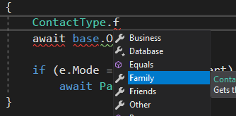

# How to: Creating an Enum (reference) type

## Problem:

In almost all applications there are concepts which only can have a set of pre-defined values.
Types of phone number, list of locations, days of the week and many other examples come to mind.
There are multiple ways to deal with these but the way that most programming languages deal with them are enums, strings, numeric values or constants of them.

When dealing with them you should make sure of multiple things

- You can easily refer to them in your code without sacrificing readability or making mistakes
- You can modify the set of pre-defined values if needed without breaking everything
- You can serialize them and store them in a database easily and modifications don't create issues for your databases/serialization code

In C# most people use enums for these sets, but while convenient, they have their own challenges which we try to eliminate.

## The M# way

The way that we deal with them in M# is using specific entities for each set of values. Compared to enums it has advantages below

- enums are integers and modifying them would need a lot of care in ordering to not break compatibility
- you cannot add any other properties to an enum and adding methods require trickeries like extension methods
- Renaming enum elements potentially can break serialization code or older databases if you don't migrate them

## How to implement

To represent such a concept in M# we usually define an entity with a single string field called name.
Then each member of the set of values can be an instance of this entity type with a unique name.
Because these values are predefined, we need to create them in the database before the application starts.
The place to add these values to our database is the `ReferenceData.cs` file in the project Domain>[DEV-SCRIPTS].
You need to simply add an entity per distinct value you need in the set.

In order to also be able to easily refer to each distinct value in the code, You should use `InstanceReferences()` method in the public constructor and include all values which you included in your `DataReferences.cs` file for the default property.

#### Example

Let's say we want to represent different types of contacts in an application.
Each contact can be either a friend, family member, business relation or another type of contact.
We need to create an entity with a `string` field like this.

```csharp

using MSharp;

namespace Model
{
    public class ContactType : EntityType
    {
        public ContactType()
        {
            InstanceAccessors("Friends", "Family", "Business", "Other");
            String("Name").Mandatory();
        }
    }
}

}
```

Then we need to open `[DEV-SCRIPTS]/ReferenceData.cs` in the **Domains** project and add all of our values in a separate method.
We will end up with something like this

```csharp

using ...;

namespace Domain
{
    class ReferenceData 
    {
        ...
        
        public async Task Create()
        {
            ...
            await CreateContactTypes();
        }
        
        ...
        
        async Task CreateContactTypes()
        {
            await Create(new ContactType { Name = "Friend" });
            await Create(new ContactType { Name = "Family" });
            await Create(new ContactType { Name = "Business" });
            await Create(new ContactType { Name = "Other" });
        }
    }
}

```

Be careful to don't forget to call the method you create in the `Create()` method where other helper methods are called.

Now you can use `ContactType` instead of an enum whenever you want to have a property which can have one of the pre-defined values (Friend, Family, Business and Other).
Thanks to `AssignReferences()`, you also have access to accessor properties for these values in your `ContactType` class. 
You can simply use them and even have intellisense as well like this:



#### Generated code

The generated code for the entity is a simple class

```csharp

public partial class ContactType : GuidEntity
    {
        /// <summary>Stores a cache for the Friends Contact type object.</summary>
        static ContactType friends;
        
        /// <summary>Stores a cache for the Family Contact type object.</summary>
        static ContactType family;
        
        /// <summary>Stores a cache for the Business Contact type object.</summary>
        static ContactType business;
        
        /// <summary>Stores a cache for the Other Contact type object.</summary>
        static ContactType other;
        
        /* -------------------------- Properties -------------------------*/
        
        /// <summary>Gets the Friends Contact type object.</summary>
        public static ContactType Friends
        {
            get
            {
                var result = friends;
                
                if (result == null)
                {
                    result = Task.Factory.RunSync(() =>Parse("Friends"));
                    
                    if (result != null && !Database.AnyOpenTransaction())
                    {
                        friends = result;
                        
                        void release() => friends = null;
                        
                        result.Saving.HandleWith(release);
                        result.Saved.HandleWith(release);
                        Database.CacheRefreshed.HandleWith(release);
                    }
                }
                
                return result;
            }
        }
        
        /// <summary>Gets the Family Contact type object.</summary>
        public static ContactType Family
        {
            get
            {
                var result = family;
                
                if (result == null)
                {
                    result = Task.Factory.RunSync(() =>Parse("Family"));
                    
                    if (result != null && !Database.AnyOpenTransaction())
                    {
                        family = result;
                        
                        void release() => family = null;
                        
                        result.Saving.HandleWith(release);
                        result.Saved.HandleWith(release);
                        Database.CacheRefreshed.HandleWith(release);
                    }
                }
                
                return result;
            }
        }
        
        /// <summary>Gets the Business Contact type object.</summary>
        public static ContactType Business
        {
            get
            {
                var result = business;
                
                if (result == null)
                {
                    result = Task.Factory.RunSync(() =>Parse("Business"));
                    
                    if (result != null && !Database.AnyOpenTransaction())
                    {
                        business = result;
                        
                        void release() => business = null;
                        
                        result.Saving.HandleWith(release);
                        result.Saved.HandleWith(release);
                        Database.CacheRefreshed.HandleWith(release);
                    }
                }
                
                return result;
            }
        }
        
        /// <summary>Gets the Other Contact type object.</summary>
        public static ContactType Other
        {
            get
            {
                var result = other;
                
                if (result == null)
                {
                    result = Task.Factory.RunSync(() =>Parse("Other"));
                    
                    if (result != null && !Database.AnyOpenTransaction())
                    {
                        other = result;
                        
                        void release() => other = null;
                        
                        result.Saving.HandleWith(release);
                        result.Saved.HandleWith(release);
                        Database.CacheRefreshed.HandleWith(release);
                    }
                }
                
                return result;
            }
        }
        
        /// <summary>Gets or sets the value of Name on this Contact type instance.</summary>
        public string Name { get; set; }
        
...
    }

```

As you can see, the code generator generated a cache field and a property per distinct value you added in `InstanceReferences()` method.
Now you can simply use values like `ContactType.Friend` in your code to refer to a contactType which is a friend.

## Remarks

- We usually show these pre-defined sets as DropDowns in forms or modules
- The values in `AssignReferences()` parameters in entity definition and `DataReferences.cs` in [DEV-SCRIPTS] should match.
- Don't worry too much about the performance of this, as you can see the values are only read once and then cached.
