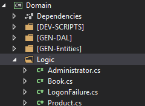

# Custom Pre-validation Logic

## Problem

sometimes, we want to run some code before running the validation logic on our entity.
One important use-case is when we want to actually set a value for some property when no value is set by the user or when we want to change/calculate correct value of a property based on some others.
M# allows you to run custom code before it runs validation logic.

## Implementation

The logic which should run before validaiton should be placed in the project by overriding the `OnValidating()` method in a class.
You should create a partial class in the `Logic` folder of the `Domain` project with the same name of your entity class.
In that class you overide the method and put the logic you need there.

#### Example

Let's say we have an entity called `Book` and it can have a property for number of parts.
We can set it to 1 if it was not set or set to a value less than one.
It can be done in `OnValidating()`.
Let's create the entity first:

```csharp
using MSharp;

namespace Model
{
    public class Book : EntityType
    {
        public Book()
        {
            String("Name").Mandatory();
            String("Author").Mandatory();
            Int("Parts").Mandatory();
        }
    }
}
```

It has nothing special but we should add a partial class with the same name ot the `Logic` folder of the `Domain` project with the following content.



```csharp
using System;
using System.Threading.Tasks;

namespace Domain
{
    public partial class Book
    {
        protected override Task OnValidating(EventArgs e)
        {
            if (Parts <= 0)
                Parts = 1;
        }
    }
}
```

As you can see we set `Parts` to 1 when it is less than or equal to 0.