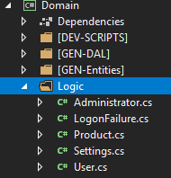

# Custom Validation Rule

## Problem

Sometimes the validation you need goes beyond what is supported by default like simple range checks or being required.
M# should allow you to extend the validation logic by code.

## Implementation

For implementing custom logic, you should override the `Validate()` method of your entity class.
To do this you should go to the `Logic` folder of your `Domain` project and create a partial class with the name of your entity class and override the method in it.
If everything is right, you should just call `return base.Validate();`, otherwise you should throw a `ValidationException`.

#### Example

Let's say we have a product class which has a creation year and a price.
In our specification, products older than 2015 should have price less than $100.
Implementing this requires custom validation.
The product entity is defined like this

```csharp
using MSharp;


namespace Domain
{
    public class Product : EntityType
    {
        public Product()
        {
            Int("Price").Mandatory();
            Int("CreationYear").Mandatory();
            String("Product Name").Mandatory().Unique();
        }
    }
}
```

There is nothing special about this.
We should create a `Product` class in the `Logic` folder of the domain project with the content below.



```csharp
using System.Threading.Tasks;
using Olive.Entities;


namespace Domain
{
    public partial class Product
    {
        public override Task Validate()
        {
            if (Price > 100 && CreationYear < 2015)
                throw new ValidationException("The price of the product and its creation year don't match");
                return base.Validate();
        }
    }
}
```

As you can see, the `Validate()` method we override, implements the custom logic and if the entity doesn't match it, it throws the exception and prevents acceptance of the entity is a valid one.