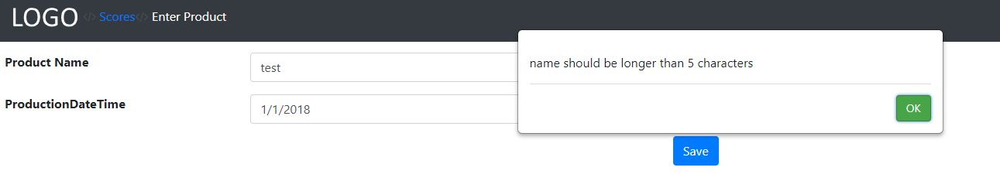

# Form specific validation

## Problem

Sometimes there might be validation logic which is only meaningful in a specific form and not for the entity in all situations.
M# should and does allow you to write form specific validation code to handle these cases.

When you have some logic which is always needed in the entity, you usually use the `Logic` folder of the `Domain` project and partial classes.
When you need to write some logic which is only valid for a specific form, you can do it in a form specific way using notifications in buttons.
In this topic we describe how to do so.

## Implementation

When we write the logic for the `OnClick()` event of a button, we can use the parameter send to the event function and its `If()` method to execute logic and show an error if the data is not passing the conditions.
The entity properties can be accessed using the `info` variable in the condition we write for `If()` method.

For example if our entity has an `Age` property, we should check it like this `x.If("info.Age < 21")`.
Then if age is less than 21, the validation fails and the method chain of the `If()` method continues.
We usually call `MessageBox()` after that and then `AndExit()` to show a message and then exit from the event.
Something like this `x.If("info.Age < 21").MessageBox("Only people older than 21 years old can access this page").AndExit()`

#### Example

Let's say we have a product entity and a form to enter new products.
When saving the product, we want to validate and check if the product name's length is less than 5 characters, don't allow the user to save it.
A form like this can be used for the purpose

```csharp
using MSharp;

namespace Modules
{
    public class ProductForm : FormModule<Domain.Product>
    {
        public ProductForm()
        {
            Field(x => x.ProductName);
            Field(x => x.ProductionDateTime);

            Button("Save").OnClick(x =>
            {
                x.If("info.ProductName.Length <= 5").MessageBox("name should be longer than 5 characters").AndExit();
                x.SaveInDatabase();
                x.GentleMessage("Saved");
                x.ReturnToPreviousPage();
            });
        }
    }
}
```

Now if we enter a product name which the length of it is less than or equal to 5 characters, the page doesn't save the product and instead shows the user an error notifying him/her about the issue.

The `ProductName` property which we used in our validation logic is exactly the one we defined in the `Product` entity here

```csharp
using MSharp;


namespace Domain
{
    public class Product : EntityType
    {
        public Product()
        {
            String("Product Name").Mandatory();
            String("ProductionDateTime").Mandatory();

        }
    }
}
```

The invalid product's message when length is less than or equal to 5 looks like this

