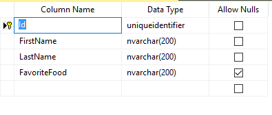

# Mandatory

## Problem

sometimes a field is optional to enter data into or not.
This might be the case for the information which the entity might/might not have or something you don't care much about and don't want to force the user to enter it.
But most other times, fields are required and always should have some data in them.
M# allows you to choose which fields are mandatory/required and which fields are optional.

## Implementation

If you want to declare a field as mandatory/required, you should call the `Mandatory()` method on the property.
In most other examples, you've seen mandatory properties and non-mandatory ones.

#### Example

We are defining an employee application which manages information about the employees of our company.
Some info like the employee name has to be there but things like their preferred food can be skipped if they don't want to talk about it or if they don't have any favorites.
We define it like this

```csharp
using MSharp;

namespace Model
{
    public class Employee : EntityType
    {
        public Employee()
        {
            String("first Name").Mandatory();
            String("Last Name").Mandatory();
            String("Favorite Food");
        }
    }
}

```

As you can see we called `Mandatory()` on some of the properties like first name and last name but not on favorite food.
This will cause the generated class to not have logic to make `FavoriteFood` a mandatory property.
It will be allowed to have null as a perfectly fine value, the DB column will be nullable and the validation code will not check it to make sure it is not null.

#### Generated Code

The generated validation code is interesting.

```csharp
public partial class Employee : GuidEntity
{
        /// <summary>Gets or sets the value of FavoriteFood on this Employee instance.</summary>
        [System.ComponentModel.DisplayName("Favorite Food")]
        public string FavoriteFood { get; set; }
        
        /// <summary>Gets or sets the value of FirstName on this Employee instance.</summary>
        [System.ComponentModel.DisplayName("first Name")]
        public string FirstName { get; set; }
        
        /// <summary>Gets or sets the value of LastName on this Employee instance.</summary>
        [System.ComponentModel.DisplayName("Last Name")]
        public string LastName { get; set; }
        
        
        /// <summary>
        /// Validates the data for the properties of this Employee and throws a ValidationException if an error is detected.<para/>
        /// </summary>
        protected override Task ValidateProperties()
        {
            var result = new List<string>();
            
            if (FavoriteFood?.Length > 200)
                result.Add("The provided Favorite Food is too long. A maximum of 200 characters is acceptable.");
            
            if (FirstName.IsEmpty())
                result.Add("first Name cannot be empty.");
            
            if (FirstName?.Length > 200)
                result.Add("The provided first Name is too long. A maximum of 200 characters is acceptable.");
            
            if (LastName.IsEmpty())
                result.Add("Last Name cannot be empty.");
            
            if (LastName?.Length > 200)
                result.Add("The provided Last Name is too long. A maximum of 200 characters is acceptable.");
            
            if (result.Any())
                throw new ValidationException(result.ToLinesString());
            
            return Task.CompletedTask;
        }
}
```

The `ValidateProperties()` method is called when storing the entity in the database.
It doesn't check for emptiness of the `FavoriteFood` property unlike `FirstName` and `LastName` which it checks for not being empty in addition to checking their length.

#### Database Schema

The columns in the database set their allow Null depending on the fact that the property is mandatory or not.



