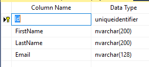

# Text Length

## Problem

Length of a text in an application is an important thing, bigger texts take a larger space in memory, database and when doing operations.
In some cases you know the exact or logically possible length of string values in your application.
M# allows you to choose how big a string property can be.

## Implementation

To specify the maximum length of a string property, we call the `Max()` method on the property.
This will affect both the database column definition of your property and the type will be varchar of the max length.
Default is 200.
The validation code checks the length of the string as well.

#### Example

Let's say we want to define an `Email` property for our employees and we know it cannot be larger than 128 characters.
We define it like this

```csharp
using MSharp;

namespace Model
{
    public class Employee : EntityType
    {
        public Employee()
        {
            String("first Name").Mandatory();
            String("Last Name").Mandatory();
            String("Email").Mandatory().Max(128);
        }
    }
}
```

The `Max()` method causes the email field to have at most 128 characters.
As a mandatory field, it cannot be empty either.

#### Generated Code

The generated employee class has this validation method.

```csharp
protected override Task ValidateProperties()
{
            var result = new List<string>();
            
            if (Email.IsEmpty())
                result.Add("Email cannot be empty.");
            
            if (Email?.Length > 128)
                result.Add("The provided Email is too long. A maximum of 128 characters is acceptable.");
            
            if (FirstName.IsEmpty())
                result.Add("first Name cannot be empty.");
            
            if (FirstName?.Length > 200)
                result.Add("The provided first Name is too long. A maximum of 200 characters is acceptable.");
            
            if (LastName.IsEmpty())
                result.Add("Last Name cannot be empty.");
            
            if (LastName?.Length > 200)
                result.Add("The provided Last Name is too long. A maximum of 200 characters is acceptable.");
            
            if (result.Any())
                throw new ValidationException(result.ToLinesString());
            
            return Task.CompletedTask;
}
```

#### Database Schema

The database schema will contain a column of max 128 characters for the email as well.

