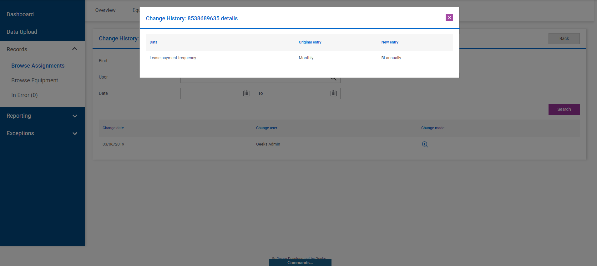

# Modal (pop up)

## Problem

Sometimes in an application, you will want a page to show as a pop up rather than a full page for a better UI experience, allowing the workflow to be more transparent to a user (ie. when you finish filling out the fields in this pop up, you will return to the parent page).

## Implementation

M# has shortcuts in place to allow us to create pop ups fairly simply.

We can use `PopUp<>` when navigating to a new page and then add `Layout(Layouts.FrontEndModal);` to that page to set the expected default layout parameters.

We then have `CloseModal()` that sends the user back to the parent page from the pop up.

## Example

Below is a list module that has a "View" button that will take the user to a pop up.

```csharp
using Domain;
using MSharp;

namespace Modules
{
    public class ChangeHistoryList : ListModule<ChangeHistory>
    {
        public ChangeHistoryList()
        {
            ViewModelProperty<Assignment>("Assignment")
                .FromRequestParam("assignment");

            SourceCriteria("item.AssignmentId == info.Assignment");

            HeaderText("Change History: @Model.Assignment.AgreementNumber");
            ShowFooterRow();

            Button("Back")
                .OnClick(x => x.ReturnToPreviousPage());

            Search(GeneralSearch.AllFields)
                .Label("Find");

            Search(x => x.CreatedBy)
                .Label("User")
                .AsAutoComplete()
                .DisplayExpression("item.Name");

            Search(x => x.CreatedAt)
                .AsDatePicker()
                .Label("Date");

            SearchButton("Search")
                .CssClass("search-button")
               .OnClick(x => x.ReturnView());

            Column(x => x.CreatedAt)
                .LabelText("Change date")
                .DisplayFormat("{0:dd/MM/yyyy}");

            Column(x => x.CreatedBy)
                .LabelText("Change user")
                .DisplayExpression("@item.CreatedBy.Name");

            ButtonColumn("View")
                .HeaderText("Change made")
                .NoText()
                .GridColumnCssClass("icon-column view-column")
                .OnClick(x => x.PopUp<Home.Records.Assignment.History.ChangeInfoPage>()
                    .Send("history", "item.ID")
                    .Pass("assignment").SendReturnUrl());

        }
    }
}
```

The `ChangeInfoPage` that the user is sent to looks like this in the back end.

```csharp
using MSharp;

namespace Home.Records.Assignment.History
{
    public class ChangeInfoPage : SubPage<HistoryPage>
    {
        public ChangeInfoPage()
        {
            Layout(Layouts.FrontEndModal);

            Add<Modules.ChangeInfoList>();
            Add<Modules.EquipmentChangeInfoList>();
        }
    }
}
```

When the user clicks "View" they will see the following pop up.



In this example, the user uses the default "X" button to close the modal.  If this was a form we could add a "Cancel" and "Save" button which would have an `OnClick()` action of `CloseModal()` which would take the user back to the previous page.

```csharp
Button("Cancel")
                .OnClick(x => x.CloseModal());
```
